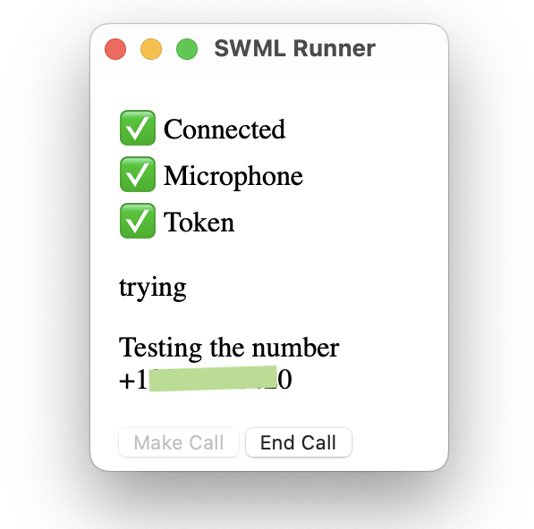

# Intro

A jerry-rigged collection of tools and scripts for fast-feedback SWML development.
Mostly stopgap: many of the features will likely be implemented officially at
some point without relying on these hacks or roundabout ways.

The tools in this repo let me write and run SWML without having
to leave my code-editor window too much. They might help you do the same.

## Tools

1. **SWML caller** (./swml_caller_helper)

   Lets you call the phone number associated with the SWML you're
   writing. Exists as a tiny GUI widget you can leave floating
   on your screen near your code editor, and call your budding AI Agent
   when you like.

   

   Internally this is a webpage being served by Node/Express.js, made into a
   free-floating window (instead of a chrome tab) using Tauri. Phone calls
   powered by SignalWire Relay v2 JS SDK.

2. **SWML server** (./swml_server)

   When your SWML-designated phone number receives a call, a request is made
   to the URL you've configured (more on this below).
   We'll configure the phone number to call the particular URL that serves the
   fresh SWML we'll be writing.

3. **SWML backend**(./swml_backend)

   If your AI agent is expected to interact with the wider internet world
   (talking to third-party APIs or your coffee machine), it is best to stand
   a kind of proxy server: something that translates the simple requests from SWML
   into possibly complex interactions and API requests to third party services.

   This SWML backend server serves that purpose. In this particular instance, it
   proxies some of the ZenDesk API functions used by our agent.

4. **LocalTunnel**

   The SWML server and the SWML backend parts are expected to be
   accessible to SignalWire servers, so having them running on your
   local machine is not enough.

   LocalTunnel is an free service (open-source, self-hostable), that makes servers
   running in your localhost accessible to the wider internet world for development
   purposes.

## Setup

1. **Install LocalTunnel**

   ```bash
   npm install -g localtunnel
   ```

2. **Set up SWML caller**

   ```bash
      cd swml_caller_helper
      npm install
      # edit env.sample to add your SignalWire credentials,
      # and then
      mv env.sample .env
   ```

   For a platform other than OSX, you'll have to build the
   Tauri codebase at `./swml_caller_helper/desktop/aicaller` yourself.

3. **Set up SWML server**

   ```bash
   cd ./swml_server
   npm install
   ```

   The SWML you'll work with is located at `./swml_server/YAML/swml.yaml`.

   In addition to this, edit the `SWMLPROXY_SD` variable in `./start.osx.sh`
   to a random subdomain that is available in localtunnel
   (`lt -h "https://localtunnel.me" -p 3500 -s yourchosensubdomain` should be successful).

   Finally, in the SignalWire dashboard, edit the number you're using to look like this:
   

4. **Set up SWML Backend**

   ```bash
   cd ./swml_backend
   npm install
   ```

   This particular backend is written to serve the
   ZenDesk support assistant, but this can be anything you
   need it to be, if you need it at all.

## Workflow

When everything has been configured, simply calling `./start.osx.sh` from
the root of the repo will:

1. Open the window for SWML caller
2. Launch the SWML server and start LocalTunnel to point `<yourchosensubdomain>.loca.lt` to the server
3. Launch the SWML backend, start localtunnel and point your SWML file to the backend

## When writing SWML

1. Validate your schema using the schema at
   [gh/olajhidey/swml-validator/](https://github.com/olajhidey/swml-validator/tree/master/schema).

   If you're using VSCode, install the [YAML extension](https://marketplace.visualstudio.com/items?itemName=redhat.vscode-yaml), then start your SWML file with the modeline:

   ```yaml
   # yaml-language-server: $schema=https://raw.githubusercontent.com/olajhidey/swml-validator/master/schema/swml-schema.json
   ```

2. To call an endpoint at `localhost:3500/get_data`, use SWML in a way
   similar to this:

   ```yaml
   data_map:
   webhooks:
      - url: https://__SUBDOMAIN__.loca.lt/get_data
         output:
         response: "data was %{data.message}"
   ```

   The `__SUBDOMAIN__` part will be replaced with your backend subdomain.

3. Use any webhook logger to read callback logs of the functions you
   call like so:

   ```yaml
   main:
   - label: ai
      ai:
         post_prompt_url: https://webhook.site/<uuid>
         prompt: ...
   ```

4. Every time you make a call to the number SWML-designated phone number, a fresh copy of
   swml.yaml will be requested. So as soon as you save your SWML file, your next call will use
   the freshest version.
